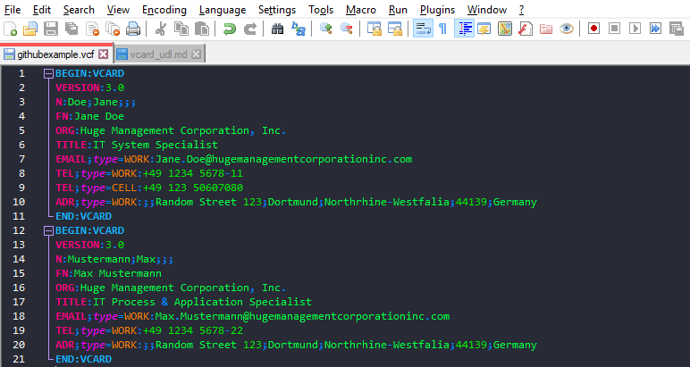
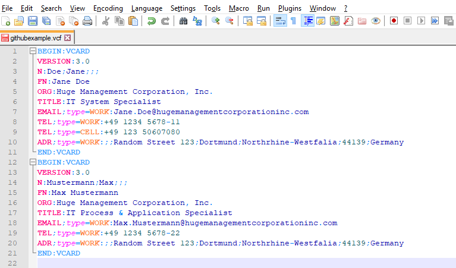

# npp_udl

## vCard UDL for Notepad++

So, this is my first contribution on GitHub. 
I was looking for a UDL file for Notepad++ as I was editing vCard/VCF files. 
Since I couldn't find one, I just created one myself. 

I included Properties and Keywords from two sources:
* IETF RFC6350, vCard Format Specification (https://tools.ietf.org/html/rfc6350)
* vCard Wikipedia Article, retreived Feb. 26 2020, https://en.wikipedia.org/wiki/VCard#Properties
This means, that keyword highlighting should work for all official vCards until version 4.0. And moreover additional parameters and properties as described in above linked Wikipedia article.
I created two versions - one for the default theme, and one for a dark theme [(in my case Dracula)](https://github.com/dracula/notepad-plus-plus). 
For the __dark theme__ I recommend you switch on "Enable global background colour" in "Global override" style (Settings --> Style Configurator)

### Screenshots
__Using a dark theme in Notepad++__

__Using Notepad++'s default theme.__

### Keywords included

#### Properties
ADR AGENT ANNIVERSARY BDAY BEGIN CALADRURI CALURI CATEGORIES CLASS CLIENTPIDMAP EMAIL END FBURL FN GENDER GEO IMPP KEY KIND LABEL LANG LOGO MAILER MEMBER N NAME NICKNAME NOTE ORG PHOTO PRODID PROFILE RELATED REV ROLE SORT-STRING SOUND SOURCE TEL TITLE TZ UID URL VERSION XML BIRTHPLACE DEATHDATE DEATHPLACE EXPERTISE HOBBY INTEREST ORG-DIRECTORY X-ABUID X-ANNIVERSARY X-ASSISTANT X-MANAGER X-SPOUSE X-GENDER X-WAB-GENDER X-AIM X-ICQ X-GOOGLE-TALK, X-GTALK X-JABBER X-MSN X-YAHOO X-TWITTER X-SKYPE, X-SKYPE-USERNAME X-GADUGADU X-GROUPWISE X-MS-IMADDRESS X-MS-CARDPICTURE X-MS-OL-DESIGN X-PHONETIC-FIRST-NAME, X-PHONETIC-LAST-NAME X-MOZILLA-HTML X-MOZILLA-PROPERTY X-EVOLUTION-ANNIVERSARY X-EVOLUTION-ASSISTANT X-EVOLUTION-BLOG-URL X-EVOLUTION-FILE-AS X-EVOLUTION-LIST X-EVOLUTION-LIST-SHOW_ADDRESSES X-EVOLUTION-MANAGER X-EVOLUTION-SPOUSE X-EVOLUTION-VIDEO-URL X-KADDRESSBOOK-BlogFeed X-KADDRESSBOOK-X-Anniversary X-KADDRESSBOOK-X-AssistantsName X-KADDRESSBOOK-X-IMAddress X-KADDRESSBOOK-X-ManagersName X-KADDRESSBOOK-X-Office X-KADDRESSBOOK-X-Profession X-KADDRESSBOOK-X-SpouseName X-KADDRESSBOOK-OPENPGPFP X-WEBMONEY-ID

#### Parameter
LANGUAGE VALUE PREF ALTID PID TYPE MEDIATYPE CALSCALE SORT-AS GEO TZ X-EVOLUTION-CALLBACK X-EVOLUTION-RADIO X-EVOLUTION-TELEX X-EVOLUTION-TTYTDD

#### Value Data Types
BOOLEAN DATE DATE-AND-OR-TIME DATE-TIME FLOAT INTEGER LANGUAGE-TAG TEXT TIME TIMESTAMP URI UTC-OFFSET

#### Values
work home text voice fax cell video pager textphone gregorian contact acquaintance co-worker neighbor sibling crush agent emergency date spouse child colleague friend met co-resident parent kin sweetheart me muse 

#### Values Registries
BEGIN END VCARD

